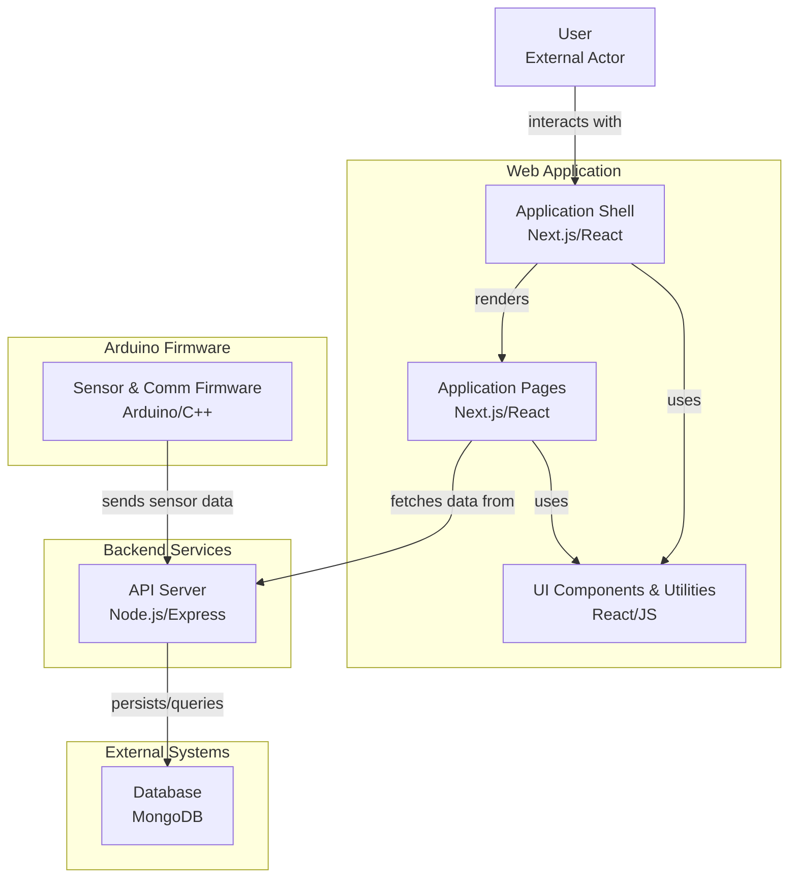

# SMARTs IOT System + AgroMate Web App


This is the **web dashboard** and backend API server for **AgroMate** — a smart soil health monitoring system. Built with **Next.js**, it displays real-time and historical data from soil sensors (NPK, DHT11, Soil Moisture) stored in **MongoDB**.


##  System Architecture 

##  Agromate + SMARTs




##  Getting Started

### 1. Clone & Install

```bash
git clone https://github.com/your-username/agromate.git
cd web-app
npm install
```

### 2. Configure Environment

Create a `.env.local` file:

```
MONGO_URI=mongodb://localhost:27017/agromate
NEXT_PUBLIC_API_BASE=http://localhost:3000
```

### 3. Run the Dev Server

```bash
npm run dev
```


##  Features

*  **Dashboard View**: Real-time NPK + Temp/Humidity + Soil Moisture
*  **Historical Charts**: Line/Bar graphs using Chart.js or Recharts
*  **API Integration**: REST endpoints under `/api`
*  **Data Sync**: Push data from ESP32 or Arduino using HTTP POST


##  Live Dashboard Preview

| Dashboard | Sensor Data History |
|-----------|---------------------|
|||


## ⚙️ Tech Stack Overview

| Technology                                                                                                                     | Description        | Role in Project                                          |
| ------------------------------------------------------------------------------------------------------------------------------ | ------------------ | -------------------------------------------------------- |
|                          | React framework    | Builds server-side rendered (SSR) & static web dashboard |
|                 | JS library         | Builds dynamic client-side UI components                 |
|                       | JavaScript runtime | Runs the Express-style backend APIs inside Next.js       |
|     | Web framework      | Handles HTTP requests from sensors and dashboard         |
|               | NoSQL database     | Stores sensor readings (NPK, DHT11, Moisture)            |
|  | CSS framework      | Styles dashboard responsively                            |
|                  | Code hosting       | Hosts repository for collaboration & CI/CD               |
|                     | Design tool        | UI mockups & wireframes                                  |


### Modules & Flow

| Module                | Description                                                       |
| --------------------- | ----------------------------------------------------------------- |
| Arduino Firmware      | Reads sensors, sends JSON via Wi-Fi (ESP32)                       |
| API Server (Express)  | Receives sensor data, stores to MongoDB, serves data to dashboard |
| MongoDB               | Persists NPK, temp/humidity, moisture history                     |
| Next.js Web Dashboard | Displays real-time + historical charts to farmers                 |


###  Installation

```bash
git clone https://github.com/your-username/agromate.git
cd web-app
npm install
```

###  Configuration

Create `.env.local`:

```bash
MONGO_URI=mongodb://localhost:27017/agromate
NEXT_PUBLIC_API_BASE=http://localhost:3000
```


###  Running Dev Server

```bash
npm run dev
```

Visit: [http://localhost:3000](http://localhost:3000)

---

##  Features

| Feature                | Description                                          |
| ---------------------- | ---------------------------------------------------- |
|  Real-time Dashboard | Displays live NPK, Temp, Humidity, Moisture data     |
|  Historical Charts   | Shows past trends with line/bar charts (Chart.js)    |
|  REST API           | Sensors POST JSON data, dashboard fetches with GET   |
|  Modular UI         | Reusable card & chart components under `/components` |
|  MongoDB Storage    | Archives all sensor readings for historical analysis |


##  Build & Deploy

```bash
npm run build
npm start
```


##  Developer Notes

* **API + Web are monolithic:** Next.js serves both UI & API.
* **MongoDB models isolated:** Located in `/server/models/`.
* **Easy to extend:** Plug new sensors, add fields to MongoDB schema, and display in charts.


##  Resources

* 📖 [Next.js Documentation](https://nextjs.org/docs)
* 📖 [MongoDB Docs](https://www.mongodb.com/docs/)
* 📖 [Chart.js](https://www.chartjs.org/docs/latest/)
* 📖 [Arduino + ESP32 WiFi](https://randomnerdtutorials.com/esp32-http-post-esp8266/)

